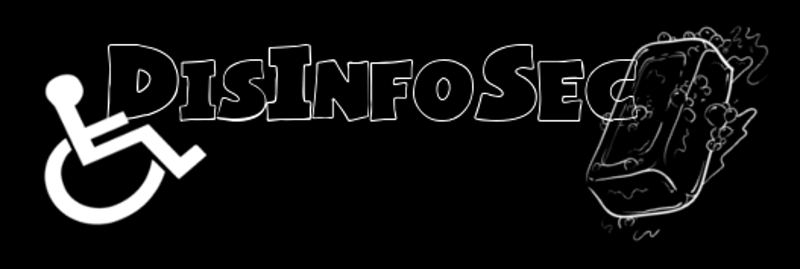

## DisInfoSec 2021, Saturday September 18th

The first DisInfoSec happened on Saturday, July 11th, 2020. 

Well, guess what? It's official. DisInfoSec 2021 is on! The tentative date is Saturday, September 18th, 2021.

This year, we will feature more disabled people talking about cybersecurity. No professional experience is required, as long as you have something to say. We will provide subtitles and all content in descriptive audio to make our event accessible to Deaf and blind people. 

I, Kim Crawley, learned a lot from running last year's event. We had a lot of great speakers, as you can read from last year's schedule. But the video stream could be glitchy at times, and my smoke detector wouldn't stop beeping! Hahaha. This year, we can work out some of the bugs.

I am delighted by the overwhelming postive reception we have received. So I'm bringing DisInfoSec 2021 together due to popular demand. 

## We have a corporate sponsor!

Thank you mongoDB! Your generous donation will go toward paying our video stream director, paying for Zoom and related technical services, and the balance will be divided between the disabled people we are raising funds for this year.

mongoDB will get lots of shoutouts during the event. It's great to see a tech company show their love for disabled people in our industry.

## We have a video stream director!

Welcome Chloe "FlyingKaida" on board as our very first employee. She will be running our video stream behind the scenes. 

Check out her [YouTube](https://www.youtube.com/channel/UC_jgy0f-DMr7NXC0afjzUbQ) and [Twitch](https://www.twitch.tv/flyingkaida) channels when you have a chance.

## Follow us on Twitter

Visit [@DisInfosec on Twitter](https://twitter.com/DisInfoSec).

## Call for Proposals

So I'm launching our CFP on June 6th. [Please submit them through this form](https://docs.google.com/forms/d/e/1FAIpQLSdYeIJDFJGqu4GDErNm4I0tQlWC9G0tQqNbWoTji7Nru3T0bw/viewform?usp=sf_link).

You have until Wednesday, August 25th, 2021 to submit a proposal. Don't be shy! Newbies are welcomed. I accepted all of the CFPs I got last year. I don't need "proof" of disability, self-identification as disabled is fine. If you have good ideas and something to say, I welcome your input.

All applicants will be notified about CFP approval on Friday, August 27th.

## Raising Funds

DisInfoSec 2021 will encourage participants ans spectators who can afford to do so to donate to three disabled people directly. I can acknowledge that sometimes charities rub by disabled people can do good work. But alas, this year I'm disillusioned by the charity model. Giving money to people directly is the best way to help a person. Unless your aims are to do something which requires a lot of money and collective effort, such as cancer research.

This tweet from our Twitter account will explain how you can help. And once all the details have been verified, we will update our website with donation info accordingly: [Here is the tweet.](https://twitter.com/DisInfoSec/status/1425593209351192583?s=09)

Ashe Grey a.k.a. @crippledscholar needs a service dog. [Here's their GoFundMe.](https://www.gofundme.com/f/get-an-autism-and-anxiety-service-dog-for-kim)

Moira is autistic and has ADHD. [Contact her directly on Twitter for payment info.]
(https://twitter.com/MoiraDavrie)

Eve Banshee is autistic and she really needs the funds in order to live a decent quality of life. [Her Venmo and Cash App details are here.]
(https://twitter.com/EveBanshee/status/1420619628359798784)

## DisInfoSec 2020 YouTube clips are here!

If you missed DisInfoSec live, all isn't lost. The entire event can be enjoyed whenever you want, [through all nine video clips uploaded to YouTube](https://www.youtube.com/playlist?list=PLU7Sd0fGdnTuRdyVgXh_L4pvVyJe9hV3L)! [Click here to check out the playlist](https://www.youtube.com/playlist?list=PLU7Sd0fGdnTuRdyVgXh_L4pvVyJe9hV3L).

## Be notified about DisInfoSec!

[Click here to sign up for the email list](https://docs.google.com/forms/d/1X3HTdzNinI7gmcAe9ahM4IRtVGzmjwFBqNJ1xfXvE8Y/) to be notified with news about DisInfoSec.

## DisInfoSec 2020 Schedule

- DisInfoSec Intro, featuring Kim Crawley 09:40 EDT/8:40 CDT/6:40 PDT/23:40 AEST/14:40 BST/15:40 CEST

- Asher Lee - A day in the life of a cyber nerd… 10:05 EDT/9:05 CDT/7:05 PDT/00:05 AEST/15:05 BST/16:05 CEST

- Sirani Alice McNeill - About malware and reverse engineering on how it impacts users in the cybersecurity format  11:05 EDT/10:05 CDT/8:05 PDT/01:05 AEST/16:05 BST/17:05 CEST

- Kim Crawley - Cybersecurity Blogging Greatest Hits 12:00 EDT/11:00 CDT/9:00 PDT/02:00 AEST/17:00 BST/18:00 CEST

- Thinker - So you want to start an information security program?  12:30 EDT/11:30 CDT/9:30 PDT/02:30 AEST/17:30 BST/18:30 CEST

- Spencer Hunley - Ain’t No Party Like A CryptoParty: Educating & Teaching Disabled Folx How To Protect Themselves In Digital Spaces  13:05 EDT/12:05 CDT/10:05 PDT/03:05 AEST/18:05 BST/19:05 CEST

- Tanya Janca - Purple is the new black: Modern Approaches to Application Security 13:35 EDT/12:35 CDT/10:35 PDT/03:35 AEST/18:35 BST/19:35 CEST

- Michael Mittelman featuring Andrea Downing - ePatients: Hacking Healthcare one Community at a Time  14:35 EDT/13:35 CDT/11:35 PDT/04:35 AEST/19:35 BST/20:35 CEST

- Be - How We Win: Neurodiversity for Belonging, Security, and Village  15:05 EDT/14:05 CDT/12:05 PDT/05:05 AEST/20:05 BST/21:05 CEST

- DisInfoSec Outro, featuring Kim Crawley 16:05 EDT/15:05 CDT/13:05 PDT/06:05 AEST/21:05 BST/22:05 CEST

## Be notified about DisInfoSec!

[Click here to sign up for the email list](https://docs.google.com/forms/d/1X3HTdzNinI7gmcAe9ahM4IRtVGzmjwFBqNJ1xfXvE8Y/) to be notified with news about DisInfoSec.

## Who is DisInfoSec?

DisInfoSec was founded and is organized by **Kim Crawley**, an autistic cybersecurity blogger. 
