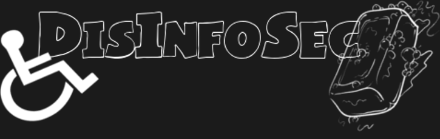

## Look forward to DisInfoSec 2022

DisInfoSec 2022 will take place sometime in September 2022. Our CFP will be announced a few months before the event. 

If you want updates in 2022, subscribe to [our mailing list]((https://docs.google.com/forms/d/1X3HTdzNinI7gmcAe9ahM4IRtVGzmjwFBqNJ1xfXvE8Y/)) or [follow our Twitter](https://twitter.com/DisInfoSec).

## DisInfoSec 2021, Saturday September 18th

DisInfoSec 2021 took place on Saturday, September 18th, 2021.

## Watch DisInfoSec 2021 on YouTube

All DisInfoSec 2021 videos are now on YouTube to watch whenever you want.

Here's the [playlist of nine videos!](https://www.youtube.com/playlist?list=PLU7Sd0fGdnTuSClAlcw-Whu9Gjng6UOML) Enjoy.

## Be notified about DisInfoSec!

[Click here to sign up for the email list](https://docs.google.com/forms/d/1X3HTdzNinI7gmcAe9ahM4IRtVGzmjwFBqNJ1xfXvE8Y/) to be notified with news about DisInfoSec.

## We have corporate sponsors!

Thank you mongoDB! Your generous donation went to paying our video stream director, paying for Zoom and related technical services, and the balance was divided between the disabled people we were raising funds for this year.

It's great to see a tech company show their love for disabled people in our industry.

Thank you Hack The Box for providing VIP+ memberships and Swag cards to our presenters and six lucky attendees.

## We have a video stream director!

Welcome Chloe "FlyingKaida" on board as our very first employee. She will be running our video stream behind the scenes. 

Check out her [YouTube](https://www.youtube.com/channel/UC_jgy0f-DMr7NXC0afjzUbQ) and [Twitch](https://www.twitch.tv/flyingkaida) channels when you have a chance.

## Follow us on Twitter

Visit [@DisInfosec on Twitter](https://twitter.com/DisInfoSec).

## Discord

Moira Davrie set up a Discord channel for DisInfoSec. Click here for it.

## DisInfoSec 2021 Schedule

Welcoming Introduction by Kim Crawley 10:25am EDT/9:25am CDT/7:25am PDT

Rodrigo Ferreira - Cybercrime Underground: A Look From Inside 10:30am EDT/9:30am CDT/7:30am PDT

Larisa Breton - Squirrel!!! Navigating Cybersecurity with a Cognitive Disability 10:50am EDT/9:50am CDT/7:50am PDT

Kim Crawley - 8 Steps to Better Security: Book Preview 11:30am EDT/10:30am CDT/8:30am PDT

Kiran Oliver - Leveraging Neurodivergence in InfoSec 12:10pm EDT/11:10am CDT/9:10pm PDT

Jess Schalz - On-Call Exhaustion, Tightropes, and You 12:50pm EDT/11:50am CDT/9:50am PDT

Jessica Tubbs - Spin Class: A Neurodiverse Hacker's Guide to Career Advancement 1:30pm EDT/12:30pm CDT/10:30am PDT

Kat Sweet - Dietary Accessibility in Tech Workplaces 2:30pm EDT/1:30pm CDT/11:30pm PDT

Catherine De Mesa - Impostor Syndrome vs Bad HR: Maximizing Your Job Hunt 4:00pm EDT/3:00pm CDT/1:00pm PDT

Florian Beijers - Hacking Blind: On Hacking with a Screenreader 4:40pm EDT/3:40pm CDT/1:40pm PDT

Closing Chat by Kim Crawley 5:00pm EDT/4:00pm CDT/2:00pm PDT

## DisInfoSec 2020 YouTube clips are here!

If you missed DisInfoSec live, all isn't lost. The entire event can be enjoyed whenever you want, [through all nine video clips uploaded to YouTube](https://www.youtube.com/playlist?list=PLU7Sd0fGdnTuRdyVgXh_L4pvVyJe9hV3L)! [Click here to check out the playlist](https://www.youtube.com/playlist?list=PLU7Sd0fGdnTuRdyVgXh_L4pvVyJe9hV3L).

## DisInfoSec 2020 Schedule

- DisInfoSec Intro, featuring Kim Crawley 09:40 EDT/8:40 CDT/6:40 PDT/23:40 AEST/14:40 BST/15:40 CEST

- Asher Lee - A day in the life of a cyber nerd… 10:05 EDT/9:05 CDT/7:05 PDT/00:05 AEST/15:05 BST/16:05 CEST

- Sirani Alice McNeill - About malware and reverse engineering on how it impacts users in the cybersecurity format  11:05 EDT/10:05 CDT/8:05 PDT/01:05 AEST/16:05 BST/17:05 CEST

- Kim Crawley - Cybersecurity Blogging Greatest Hits 12:00 EDT/11:00 CDT/9:00 PDT/02:00 AEST/17:00 BST/18:00 CEST

- Thinker - So you want to start an information security program?  12:30 EDT/11:30 CDT/9:30 PDT/02:30 AEST/17:30 BST/18:30 CEST

- Spencer Hunley - Ain’t No Party Like A CryptoParty: Educating & Teaching Disabled Folx How To Protect Themselves In Digital Spaces  13:05 EDT/12:05 CDT/10:05 PDT/03:05 AEST/18:05 BST/19:05 CEST

- Tanya Janca - Purple is the new black: Modern Approaches to Application Security 13:35 EDT/12:35 CDT/10:35 PDT/03:35 AEST/18:35 BST/19:35 CEST

- Michael Mittelman featuring Andrea Downing - ePatients: Hacking Healthcare one Community at a Time  14:35 EDT/13:35 CDT/11:35 PDT/04:35 AEST/19:35 BST/20:35 CEST

- Be - How We Win: Neurodiversity for Belonging, Security, and Village  15:05 EDT/14:05 CDT/12:05 PDT/05:05 AEST/20:05 BST/21:05 CEST

- DisInfoSec Outro, featuring Kim Crawley 16:05 EDT/15:05 CDT/13:05 PDT/06:05 AEST/21:05 BST/22:05 CEST

## Who is DisInfoSec?

DisInfoSec was founded and is organized by **Kim Crawley**, an autistic cybersecurity blogger. 
