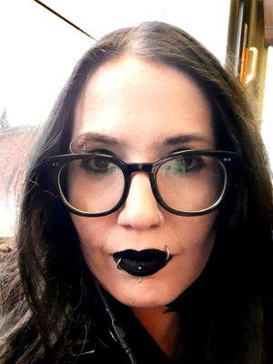

## DisInfoSec is an online cybersecurity conference featuring disabled speakers

So the COVID19 pandemic has killed conventional cybersecurity conferences and events which meet offline. That's okay, we can have cybersecurity events online! Inspired by [BeerConOne](https://thebeerfarmers.org/beer-con-one-bc1/) and Lesley Carhart's [PancakesCon](https://tisiphone.net/2020/03/15/pancakescon-2020-quarantine-edition/amp/), cybersecurity blogger Kim Crawley has decided to start an online cybersecurity conference of her own. But this time, the spotlight will be on **disabled people** with infosec knowledge.

Do you identify as disabled and have cybersecurity knowledge you'd like to share? DisInfoSec would love to feature you as a speaker! Cybersecurity nerds presenting at DisInfoSec may have any level of experience in their careers, and may be from every infosec specialty, from redteamers to network admins, from SOC analysts to CISOs, from malware researchers to desktop support, from students to teachers, from web application developers to the recently made unemployed.

## Saturday, June 13th or Saturday, July 11th 2020?

DisInfoSec was originally planned to take place on **Saturday, June 13th, 2020.** 

## An update due to recent international chaos

The murder of George Floyd at the hands of the Minneapolis Police was the straw that broke the camel's back of decades of police violence, especially targeted to Black people, and the capitalist system's abuse of most of the population. Protests have ignited, first across the United States, then worldwide. I, Kim Crawley, attended the Toronto protest for Regis Korchinski-Paquet on May 30th. She was a BIPOC woman and she was very likely murdered by Toronto Police in her apartment that's distrubingly close to where I live. Like George Floyd, Trayvon Martin, Michael Brown, and countless other Black people, Regis' murder reflects the racism inherent in the history of policing.

A wonderful, talented disabled infosec person had a great CFP for DisInfoSec. But she's in Minneapolis, which is now a warzone where cops even shoot white people for merely existing. She told me she would be unable to present on June 13th. She is currently providing first aid to the victims of the carnage which is continuing. I told her her life and the lives of her loved ones are way more important than DisInfoSec.

DisInfoSec will go on, but I'm considering rescheduling the event for **Saturday July 11th.**

Please [see my Twitter thread](https://twitter.com/kim_crawley/status/1267448579418923009?s=20) for more details and to vote as to whether or not you'd like DisInfoSec to be rescheduled.

While you're here, please consider donating to a GoFundMe to support Black Lives Matter.

* [COVID-19- GTA (Toronto) BLACK COMMUNITY EMERGENCY SUPPORT FUND](https://www.gofundme.com/f/black-emergency-support-fund)
* [Black Lives Matter Solidarity Fund NS (Nova Scotia, Canada)](https://www.gofundme.com/f/black-lives-matter-solidarity-fund-ns)
* [Justice For Regis (Toronto)](https://www.gofundme.com/f/justice-for-regis)
* [Black Lives Matter DC Legal Support Fund](https://www.gofundme.com/f/defendblmdc)

Whether or June or July, DisinfoSec will be hosted via Zoom and broadcasted via Twitch and YouTube. **All people are welcome to attend, whether or not you're disabled.** Watch this space for more info about presentation times and how to attend, or [fill out this form to be notified when online attendance information becomes available.](https://docs.google.com/forms/d/e/1FAIpQLSfTZZKmW8F4d_mLfXgzTFmqCfpR8cGz-M-XHvXV9uJuVz6JNw/viewform)

## Donate to DisInfoSec!

DisInfoSec is raising funds for organizations that are **run by disabled people** for **disabled people.** 

[Click here to donate to our GoFundMe campaign!](https://www.gofundme.com/f/help-disinfosec-raise-funds-for-disability-rights)

The Autistic Self Advocacy Network was founded by autistic people to advocate for the rights of autistic people. [Their mission statement from their website is](https://autisticadvocacy.org/about-asan/):

"The Autistic Self Advocacy Network seeks to advance the principles of the disability rights movement with regard to autism. ASAN believes that the goal of autism advocacy should be a world in which autistic people enjoy equal access, rights, and opportunities. We work to empower autistic people across the world to take control of our own lives and the future of our common community, and seek to organize the autistic community to ensure our voices are heard in the national conversation about us. Nothing About Us, Without Us!"

The Autistic Women & Nonbinary Network was founded by autistic people to advocate for the rights of autistic people who are female or nonbinary. [Their mission statement from their website is](https://awnnetwork.org/about/):

"The mission of Autistic Women & Nonbinary Network (AWN) is to provide community, support, and resources for Autistic women, girls, nonbinary people, and all others of marginalized genders.

AWN Network  is dedicated to building a supportive community where we can share our experiences in an understanding, diverse and inclusive environment. AWN is committed to recognizing and celebrating diversity and the many intersectional experiences in our community.

We welcome all women, transgender and cisgender, non-binary and genderqueer people, Two-Spirit people, people who have at anytime identified as women or girls, and all other people of marginalized genders or of no gender. AWN recognizes and affirms all people’s gender identities and expressions, as well as choices about disclosure, transition, and going stealth.

Our goal is to dispel stereotypes and misinformation which perpetuate unnecessary fears surrounding an autism diagnosis. We seek to share information which works to build acceptance and understanding of disability. Welcome to AWN Network!"

The Council of Canadians with Disabilities was founded by disabled people to advocate for Canadians with all disabilities.
[Their mission statement from their website is](http://ccdonline.ca/en/about/):

"The Council of Canadians with Disabilities (CCD) is a social justice organization of people with all disabilities that champions the voices of people with disabilities, advocating an inclusive and accessible Canada, where people with disabilities have full realization of their human rights, as described in the UN Convention on the Rights of Persons with Disabilities."

Some funds will go toward paying disabled event workers and making the event accessible to the Deaf and hard of hearing.

[Click here to donate to our GoFundMe campaign!](https://www.gofundme.com/f/help-disinfosec-raise-funds-for-disability-rights)

## Call for Proposals (CFPs)

People with infosec knowledge are welcome to submit a CFP to apply as a speaker during this event, as long as they identify as disabled. [Please use this form to submit your CFP.](https://docs.google.com/forms/d/e/1FAIpQLSdYeIJDFJGqu4GDErNm4I0tQlWC9G0tQqNbWoTji7Nru3T0bw/viewform?usp=sf_link) 

I have already approved a few excellent CFPs for DisInfoSec. I have extended to deadline for CFPs to **Wednesday, June 10th**, whether or not DisInfoSec is rescheduled.

## Am I disabled?

You are disabled if you have a disabling condition **and** self-identify as disabled. No medical documentation is necessary! (Don't share your sensitive medical info with strangers on the internet, that's bad opsec. Ha!) Disabilities can include, **but absolutely aren't limited to** the following:

- Neurodivergent conditions such as autism, ADHD, dyslexia, learning disorders, developmental disabilities, and mental health conditions such as anxiety, dissociative identity disorder, eating disorders, and bipolar disorder.

- Conditions that affect how you sense the world, such as being Deaf or blind.

- Conditions that affect your physical mobility, such as cerebral palsy, amputations, paraplegia, or Parkinson's disease.

- Conditions that affect how you fit into the world, such as Dwarfism.

- Other conditions such as chronic fatigue syndrome or traumatic brain injuries.

Your disabilities may not be on this list. Your disabilities might not be medically diagnosed or recognized by the government. **The most important factor is that you self-identify as disabled. We don't need proof of a disability.**

## Let's make DisInfoSec accessible to as many disabilities as possible!

If you're disabled and you know how an online streaming video event can be made more accessible for you, [please submit your ideas in this form.](https://docs.google.com/forms/d/e/1FAIpQLScc90kqggCMwmYvulv-otFO1CdhJlbr97EVZDWs_SN78YSknQ/viewform?usp=sf_link) We're already considering transcriptions and American Sign Language for Deaf people and descriptive audio for blind people. If you have ideas for implementing that, or if there are ways that DisInfoSec can be accessible for other disabilities, [please submit your ideas in this form.](https://docs.google.com/forms/d/e/1FAIpQLScc90kqggCMwmYvulv-otFO1CdhJlbr97EVZDWs_SN78YSknQ/viewform?usp=sf_link)

## Who is DisInfoSec?

DisInfoSec was founded and is organized by **Kim Crawley**, an autistic cybersecurity blogger. More personnel will be added to this section as event organization progresses.
